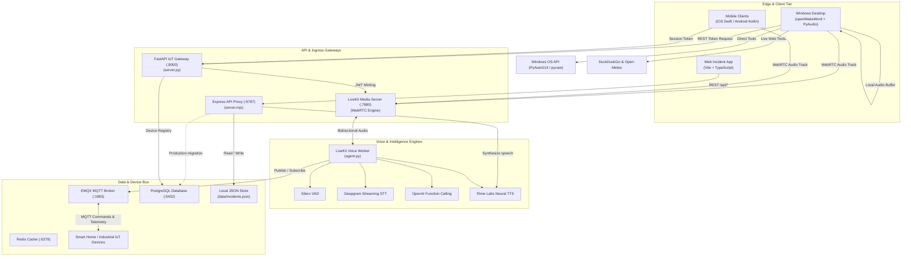

# System Architecture Specification

## Overview

**Voice Bridge & Ambient IoT Voice Platform** is a distributed, multi-modal system designed for low-latency voice interaction, automated operational handoffs, and smart physical device orchestration. The platform bridges natural voice input to deterministic action via two distinct operational pipelines:

1. **Voice-Native Incident Handoff Pipeline**: Browser/mobile speech ingestion $\rightarrow$ entity extraction $\rightarrow$ structured persistence $\rightarrow$ synthesized audio briefing via Rime Neural TTS.
2. **Ambient IoT & Desktop Automation Pipeline**: Zero-loss local wake gating ("Hey Jarvis") $\rightarrow$ WebRTC streaming $\rightarrow$ Silero VAD / Deepgram STT $\rightarrow$ LLM reasoning $\rightarrow$ OS actions and MQTT device execution.

---

## 1. High-Level Component Topology



---

## 2. Subsystem Architectures

### 2.1 Web Incident Handoff System

- **Client Ingestion**: Captures natural voice through the Web Speech API (`webkitSpeechRecognition` / `SpeechRecognition`). Includes a fallback mechanism with mock sample reports for automated testing or headless environments.
- **Entity Extraction**: Rule-based deterministic extraction engine in [src/main.ts](file:///c:/Users/ry729/arc-task-gen/src/main.ts). Identifies:
  - **Location**: Specific facilities, rooms, substations, or assets.
  - **Issue**: Root mechanical, electrical, or software failure.
  - **Owner**: Frontline operator on site.
  - **Urgency**: `critical`, `high`, or `standard`.
  - **Next Step**: Immediate tactical response or dispatch order.
- **Express Proxy Boundary**: [server.mjs](file:///c:/Users/ry729/arc-task-gen/server.mjs) isolates third-party API credentials (`RIME_API_KEY`). The browser client never touches external API secrets.
- **Audio Output**: Synthesizes the debrief via `POST /api/speak` using Rime's `mist` model. Audio is piped back as `audio/mpeg` or `audio/wav` for low-latency playback.

---

### 2.2 Ambient IoT Voice Agent (`agent.py`)

- **WebRTC Transport**: LiveKit provides sub-100ms peer-to-peer WebRTC audio streaming between edge clients and the backend worker.
- **Audio Pipeline**:
  ```text
  [Client Mic] ──WebRTC──► [LiveKit Server] ──Track──► [agent.py]
                                                          │
          ┌───────────────────────────────────────────────┘
          ▼
      [Silero VAD] (Detects voice presence, filters ambient noise)
          ▼
      [Deepgram STT] (Streams real-time transcribed text)
          ▼
      [OpenAI LLM] (Evaluates context & executes function tools)
          ├── Tool: set_device_state(device_id, state, value)
          └── Tool: get_device_status(device_id)
          ▼
      [Rime TTS Plugin] (Generates spoken response)
          ▼
  [Client Speaker] ◄──WebRTC── [LiveKit Server] ◄──Track──┘
  ```
- **MQTT Event Mesh**:
  - **Command Topic**: `home/devices/{device_id}/set`
  - **Telemetry Topic**: `home/devices/{device_id}/telemetry`
  - **QoS**: Level 1 (At least once delivery) with automatic state caching.

---

### 2.3 Windows Voice Assistant & Zero-Loss Buffer

- **Problem Solved**: Most voice assistants lose the first 200–500ms of user speech while initializing the cloud connection or wake-word model.
- **Circular Ring Buffer**: [clients/windows/audio_buffer.py](file:///c:/Users/ry729/arc-task-gen/clients/windows/audio_buffer.py) continuously holds 1.5 seconds of 16 kHz 16-bit PCM audio in memory.
- **Atomic Drain**: Upon wake detection ("Hey Jarvis"):
  1. The pre-roll buffer is atomically captured.
  2. The local chime fires via `sounddevice`.
  3. Pre-roll bytes are concatenated with incoming live frames.
- **Barge-In Lifecycle**:
  - During Rime audio playback, the openWakeWord thread continues monitoring input audio.
  - If "Hey Jarvis" is spoken during playback:
    1. Active playback is abruptly stopped (`sd.stop()`).
    2. Pending speech generation queues are cleared.
    3. The assistant immediately transitions back to the recording state.

---

## 3. Data Flow & State Transitions

### Wake-Word State Machine
```text
  ┌────────────────────────────────────────────────────────┐
  │                        SLEEPING                        │
  │  • Continuous 16kHz PCM recording                      │
  │  • Rolling 1.5s Pre-Roll Ring Buffer                   │
  │  • openWakeWord inference loop active                  │
  │  • No network transmission                             │
  └───────────────────────────┬────────────────────────────┘
                              │
                    Wake Word Detected
                              ▼
  ┌────────────────────────────────────────────────────────┐
  │                       TRIGGERED                        │
  │  • Play audio chime (24kHz stereo beep)                │
  │  • Atomically drain pre-roll buffer                    │
  │  • Request token / connect session                     │
  └───────────────────────────┬────────────────────────────┘
                              │
                    Session Connected
                              ▼
  ┌────────────────────────────────────────────────────────┐
  │                       LISTENING                        │
  │  • Capture speech frames                               │
  │  • VAD Silence Threshold: 1.2s cut-off                 │
  │  • Maximum utterance: 10s timeout                      │
  └───────────────────────────┬────────────────────────────┘
                              │
                      Silence Detected
                              ▼
  ┌────────────────────────────────────────────────────────┐
  │                       PROCESSING                       │
  │  • OpenAI Tool Calling                                 │
  │  • Execute OS action or MQTT command                   │
  │  • Stream tokens to Rime WebSocket                     │
  └───────────────────────────┬────────────────────────────┘
                              │
                     Audio Stream Begins
                              ▼
  ┌────────────────────────────────────────────────────────┐
  │                        SPEAKING                        │
  │  • Stream 24kHz PCM audio playback                     │
  │  • Background Wake Detector remains active             │
  │  • "Hey Jarvis" triggers immediate abort (Barge-In)    │
  └───────────────────────────┬────────────────────────────┘
                              │
                    Playback Completed
                              ▼
  ┌────────────────────────────────────────────────────────┐
  │                        LATCHED                         │
  │  • 6.0s multi-turn conversational window               │
  │  • Follow-up speech recorded WITHOUT wake word         │
  └───────────────────────────┬────────────────────────────┘
                              │
                      Latch Timeout (6s)
                              ▼
                        [To SLEEPING]
```

---

## 4. Security & Isolation Boundaries

| Boundary | Inbound Protocols | Outbound Protocols | Security Controls |
| :--- | :--- | :--- | :--- |
| **Web Client $\leftrightarrow$ Express** | HTTP (`:5173` $\rightarrow$ `:8787`) | JSON, Audio Stream | CORS restricted, server-side `.env` key storage |
| **Native Client $\leftrightarrow$ FastAPI** | HTTP/JSON (`:8000`) | Signed JWT | Ephemeral tokens (15m validity), room-scoped |
| **Native Client $\leftrightarrow$ LiveKit** | WebRTC (`:7880`, `:7881`, `:7882/udp`) | Encrypted SRTP Audio | DTLS-SRTP encryption, signed JWT validation |
| **Agent $\leftrightarrow$ EMQX** | TCP (`:1883`) | MQTT 5.0 QoS 1 | Topic scoping (`home/devices/+/set`), optional TLS |
| **Express/Agent $\leftrightarrow$ Rime/OpenAI** | HTTPS / WSS | Neural TTS / LLM stream | TLS 1.3 encrypted, bearer authentication |
